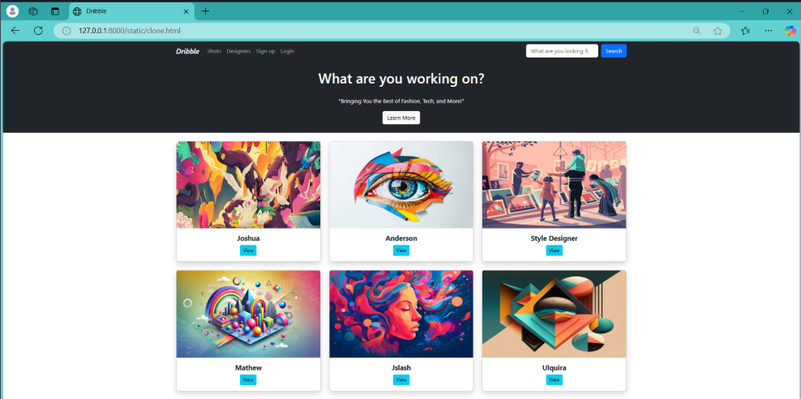

# Project Responsive Web Design using Bootstrap
# Date: 7-10-2025
# AIM:
To create a simplified clone of Dribbble (https://dribbble.com/) landing page.

# DESIGN STEPS:
## Step 1:
Clone the repository from GitHub.

## Step 2:
Create Django Admin project.

## Step 3:
Create a New App under the Django Admin project.

## Step 4:
Insert the necessary CSS and JavaScript files as external in order to use Bootstrap.

## Step 5:
Create a HTML file and include the needed Bootstrap components.

## Step 6:
Publish the website in the LocalHost.

# PROGRAM :

```
HTML

<!doctype html>
<html lang="en">
  <head>
    <meta charset="utf-8">
    <meta name="viewport" content="width=device-width, initial-scale=1">
    <title>Dribble</title>
    <link href="https://cdn.jsdelivr.net/npm/bootstrap@5.3.3/dist/css/bootstrap.min.css" rel="stylesheet">
  </head>
  <body>
    <nav class="navbar navbar-expand-sm navbar-dark bg-dark">
      <div class="container">
        <a href="#Logo" class="navbar-brand mb-0 h1"><i>Dribble</i></a>
        <button class="navbar-toggler" type="button" data-bs-toggle="collapse" data-bs-target="#navbarNav">
          <span class="navbar-toggler-icon"></span>
        </button>
        <div class="collapse navbar-collapse" id="navbarNav">
          <ul class="navbar-nav">
            <li class="nav-item">
              <a href="#" class="nav-link" aria-current="page">Shots</a>
            </li>
            <li class="nav-item">
              <a href="#" class="nav-link">Designers</a>
            </li>
            <li class="nav-item">
              <a href="signup.html" class="nav-link">Sign up</a>
            </li>
            <li class="nav-item">
              <a href="#" class="nav-link">Login</a>
            </li>
          </ul>
          <div class="ms-auto">
            <form class="d-flex" role="search">
              <input class="form-control me-2" type="search" placeholder="What are you looking for?" aria-label="Search">
              <button class="btn btn-primary" type="submit">Search</button>
            </form>
          </div>
        </div>
      </div>
    </nav>

    <section class="text-center py-4 bg-dark text-white">
      <div class="container">
        <h1>What are you working on?</h2>
            <br>
            <p>"Bringing You the Best of Fashion, Tech, and More!"</p>
        <div class="d-inline-flex gap-2">
          <a href="#" class="btn btn-light">Learn More</a>
        </div>
      </div>
    </section>

    <div class="container py-4">
      <div class="row justify-content-center g-4">
        <div class="col-md-4">
          <div class="card shadow rounded-3">
            
            <div class="card-body text-center">
              <h5 class="card-title fw-bold">Joshua</h5>
              <a href="#" class="btn btn-info btn-sm">View</a>
            </div>
          </div>
        </div>
        <div class="col-md-4">
          <div class="card shadow rounded-3">
            
            <div class="card-body text-center">
              <h5 class="card-title fw-bold">Anderson</h5>
              <a href="#" class="btn btn-info btn-sm">View</a>
            </div>
          </div>
        </div>
        <div class="col-md-4">
          <div class="card shadow rounded-3">
            
            <div class="card-body text-center">
              <h5 class="card-title fw-bold">Style Designer</h5>
              <a href="#" class="btn btn-info btn-sm">View</a>
            </div>
          </div>
        </div>
        <div class="col-md-4">
          <div class="card shadow rounded-3">
            
            <div class="card-body text-center">
              <h5 class="card-title fw-bold">Mathew</h5>
              <a href="#" class="btn btn-info btn-sm">View</a>
            </div>
          </div>
        </div>
        <div class="col-md-4">
          <div class="card shadow rounded-3">
            
            <div class="card-body text-center">
              <h5 class="card-title fw-bold">Jslash</h5>
              <a href="#" class="btn btn-info btn-sm">View</a>
            </div>
          </div>
        </div>
        <div class="col-md-4">
          <div class="card shadow rounded-3">
            
            <div class="card-body text-center">
              <h5 class="card-title fw-bold">Ulquira</h5>
              <a href="#" class="btn btn-info btn-sm">View</a>
            </div>
          </div>
        </div>
      </div>
    </div>

    <script src="https://cdn.jsdelivr.net/npm/bootstrap@5.3.3/dist/js/bootstrap.bundle.min.js"></script>
  </body>
</html>


```
# OUTPUT:



# RESULT:
The Project for responsive web design using Bootstrap is completed successfully.
